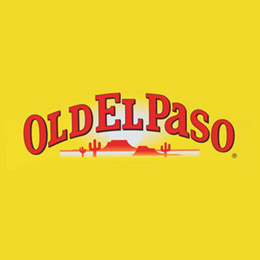

# El Géo Paso

 [](https://travis-ci.org/Guts/elpaso)
[](https://heroku.com/deploy)

Statistiques dynamiques sur les offres d'emploi en géomatique publiées sur le forum francophone de géomatique [GeoRezo](http://georezo.net/forum/viewforum.php?id=10).

## Projet

### Auteurs

L'idée initiale est celle de [Pierre Vernier](https://github.com/pvernier) et de [Julien Moura](https://github.com/Guts), portés que nous étions par la regrettée dynamique de [Geotribu](http://geotribu.net) !

Les bénévoles de GeoRezo ont aussi contribué à relancer la dynamique lorsqu'elle s'éteignait, que ce soit [Yves Jacolin](https://github.com/yjacolin) pour les aspects techniques, [Marc Isenmann](https://www.linkedin.com/in/marc-isenmann-9b764b109/) pour son intérêt jamais démenti pour l'analyse des offres qu'il modère depuis tant d'années et Bruno Iratchet pour son soutien ponctuel.

### Pourquoi El Paso

Pourquoi El Paso ? Depuis des temps immémoriaux, le choix d'un nom de projet informatique est cornélien (le mot est sûrement trop faible). Né autour de fajitas et de rhum, le nom El Paso s'est imposé comme une évidence. Bien traduit, il représente le petit pas qui sépare un chercheur d'emploi d'un poste. Une simple offre, un simple pas... non, en fait, rien de tout cela, c'est juste parce-que les fajitas étaient bonnes !



----

## Description fonctionnelle

### Récupération à partir de GeoRezo

1. Toutes les heures, les dernières offres publiées sont récupérées à partir du [flux RSS du forum Job de GeoRezo](https://georezo.net/extern.php?fid=10) et stockées en brut dans une table dédiée ;
2. Chaque nouvelle offre est analysée en s'appuyant sur le kit de traitement du langage naturel NLTK et des correspondances personnalisables en base de données via l'interface d'administration ;

### Représentation des données

Les données sont ensuite représentées dans différents modes :

* métriques globales ;
* valeurs absolues du nombre d'offre par période ;
* valeurs proportionnelles selon le différents critères (types de contrats...)

----

## Description technique

Pour dupliquer le projet, la documentation est dans [le wiki du dépôt](https://github.com/Guts/elpaso/wiki).

### Base de données


    *Modèle généré automatiquement par Django Extensions graph-models (pydot)*

### Briques logicielles

Le projet est développé en Python 3.5.x avec le framework Django et des extensions :

* [feedparser](https://pypi.org/project/feedparser/) pour la consommation du flux RSS
* [NLTK](http://www.nltk.org/) pour l'analyse sémantique
* [DRF (Django REST Framework)](http://www.django-rest-framework.org/) et [drf-yasg](https://github.com/axnsan12/drf-yasg/) pour la mise en place de l'API REST et sa documentation automatisée
* [Django Extensions](https://github.com/django-extensions/django-extensions) pour la boîte à outils de dév Django

Du côté de l'interface du site web, on retrouve les classiques :

* [Bootstrap](https://getbootstrap.com/)
* [D3.js](https://d3js.org/), via la surcouche [NVD3](http://nvd3.org)
* [Django Suit](https://djangosuit.com/) pour l'habillage de l'interface d'administration

Le site est servi sur le Web par [gunicorn](https://gunicorn.org/) et nginx ou Apache selon les plateformes (dév ou production).

### Docker

With Docker installed, launch these commands within the repository folder:

```powershell
# build the container
docker build --rm -f Dockerfile -t elgeopaso:latest .
# launch it in detached mode
docker run --name elgeopaso --rm -it -d -p 8000:8000 elgeopaso:latest
```

Then, open your favorite browser to <http://localhost:8000.>

To stop it : ```docker stop elgeopaso```
