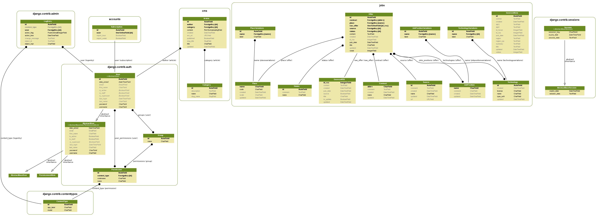

# El Géo Paso


[](https://codecov.io/gh/Guts/elgeopaso)

[](https://elgeopaso.readthedocs.io/en/latest/?badge=latest)

[](https://heroku.com/deploy)

----

## Développement

### Docker

```shell
docker-compose -f "docker-compose.dev.yml" up --build
```

Ouvrir le site sur <http://localhost:8000>.

----

> TO MOVE

## Description fonctionnelle

### Récupération à partir de GeoRezo

1. Toutes les heures, les dernières offres publiées sont récupérées à partir du [flux RSS du forum Job de GeoRezo](https://georezo.net/extern.php?fid=10) et stockées en brut dans une table dédiée ;
2. Chaque nouvelle offre est analysée en s'appuyant sur le kit de traitement du langage naturel NLTK et des correspondances personnalisables en base de données via l'interface d'administration ;

### Représentation des données

Les données sont ensuite représentées dans différents modes :

* métriques globales ;
* valeurs absolues du nombre d'offre par période ;
* valeurs proportionnelles selon le différents critères (types de contrats...)

----

## Description technique

Pour dupliquer le projet, la documentation est dans [le wiki du dépôt](https://github.com/Guts/elgeopaso/wiki).

### Base de données



    *Modèle généré automatiquement par Django Extensions graph-models (pydot)*

### Briques logicielles

Le projet est développé en Python 3.5.x avec le framework Django et des extensions :

* [feedparser](https://pypi.org/project/feedparser/) pour la consommation du flux RSS
* [NLTK](http://www.nltk.org/) pour l'analyse sémantique
* [DRF (Django REST Framework)](http://www.django-rest-framework.org/) et [drf-yasg](https://github.com/axnsan12/drf-yasg/) pour la mise en place de l'API REST et sa documentation automatisée
* [Django Extensions](https://github.com/django-extensions/django-extensions) pour la boîte à outils de dév Django

Du côté de l'interface du site web, on retrouve les classiques :

* [Bootstrap](https://getbootstrap.com/)
* [D3.js](https://d3js.org/), via la surcouche [NVD3](http://nvd3.org)
* [Django Suit](https://djangosuit.com/) pour l'habillage de l'interface d'administration

Le site est servi sur le Web par [gunicorn](https://gunicorn.org/) et nginx ou Apache selon les plateformes (dév ou production).
